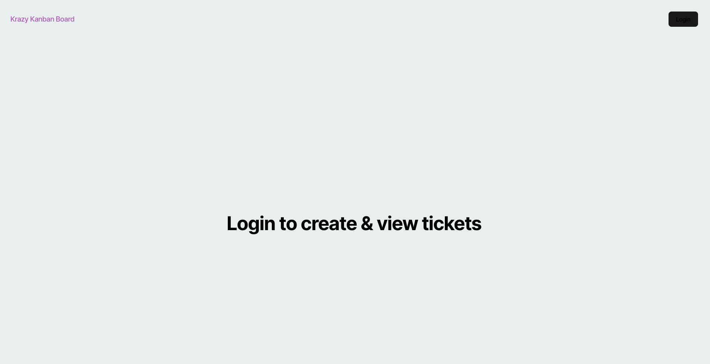
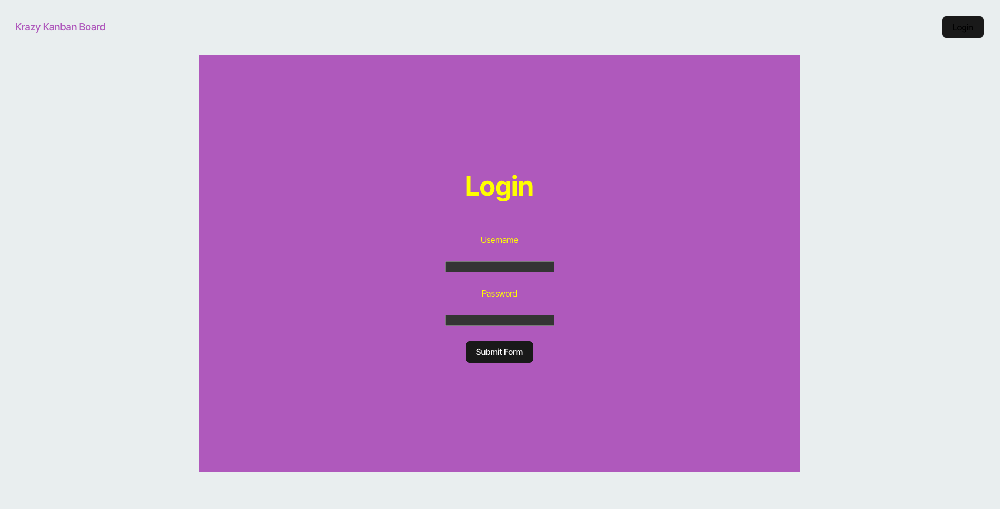
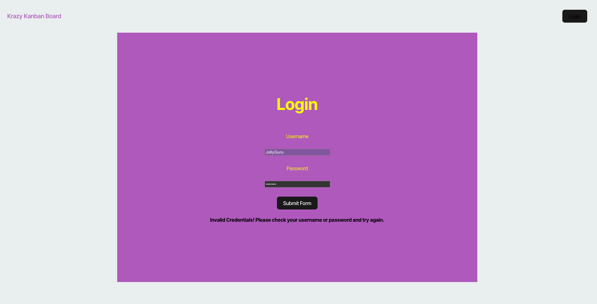
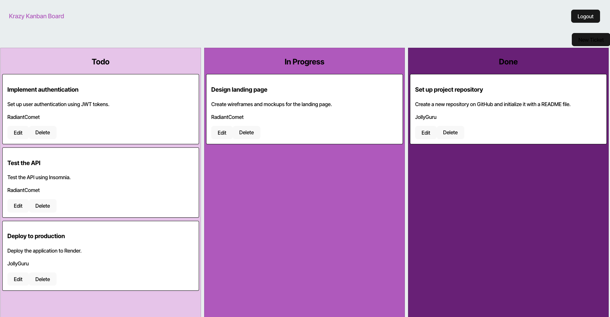
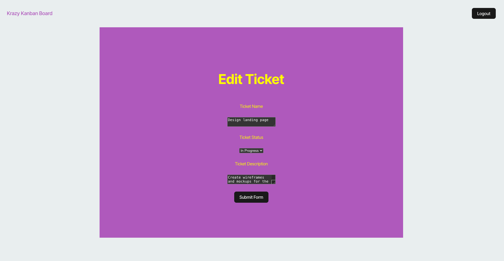
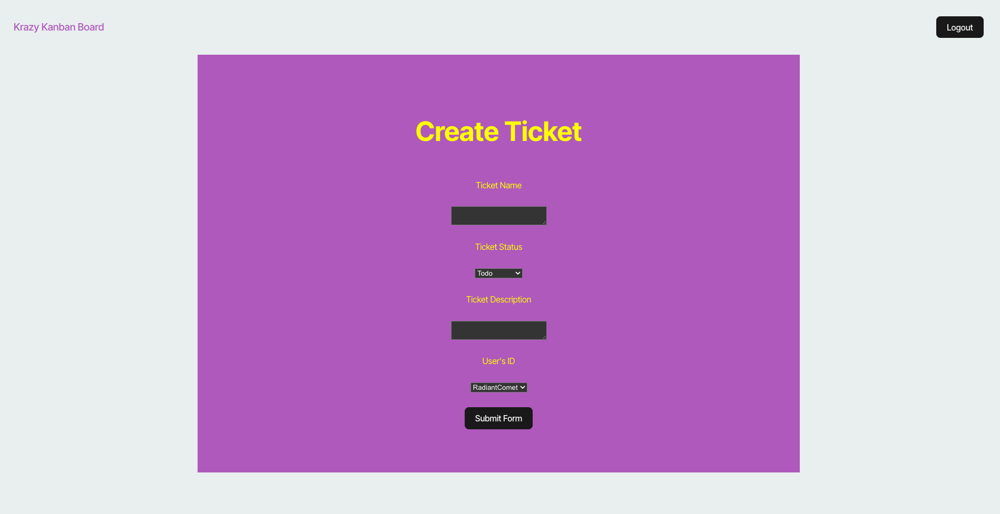

# Task Tracker Kanban

## Description

This is a kanban board to help manage tasks!

## Table of Contents

- [Installation](#installation)
- [Usage](#usage)
- [Credits](#credits)
- [License](#license)
- [Contributing](#contributing)
- [Tests](#tests)
- [Questions](#questions)

## Installation

To use the project, click this [link](https://task-tracker-kanban.onrender.com/) to navigate to the webpage. The site is deployed to a free Render server, so it may take over a minute for it to load. Just be patient.

## Usage

To get started, navigate to the site.

When the page loads, it will look like this.

Click on the "Login" button in the upper right corner of the page to login. It will then direct you to this screen.

There are currently three usernames to choose from to log in. Use any one of these username/ password combos.
- username: JollyGuru  ;  password: password
- username: SunnyScribe  ;  password: password
- username: RadiantComet  ;  password: password

If the password or username is incorrect, this page will display alerting you to the error. Simply re-enter the username and password.

Once you have successfully logged in, you will see this page with the current tickets. 

Here you will be able to edit, delete, or create tickets. The following images show the features of both the edit ticket and create new ticket pages. 

Clicking on the "Logout" button in the upper right corner of the screen at any time will return the website to the main login screen.

The authentication token expires after 1 hour and will log you out automatically. You would need to log back in to continue work.

That's it for the features of the Task Tracker Kanban! Feel free to explore it!

## Credits

- The starter files for the project were provided by EdX Boot Camps
- Grok by xAI and GitHub CoPilot were used to help debug my code in various places

## License

Licensed under the [MIT](./LICENSE) license.

## Contributing

This project has no contribution guidelines.

## Tests

There are no test instructions developed for this project.

## Questions

- GitHub: [Johngoldade](https://github.com/Johngoldade)
- Email: [goldade.john@gmail.com](mailto:goldade.john@gmail.com)

To ask further questions, reach out to me at the above email and I will get back to you as soon as I can.